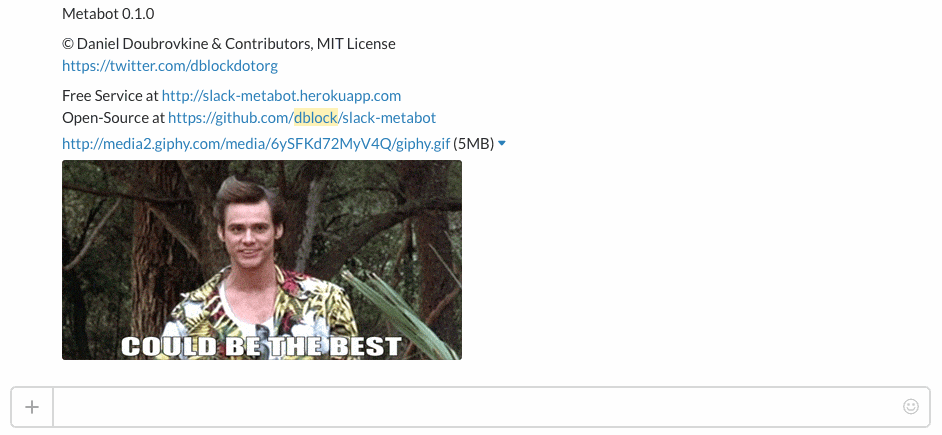
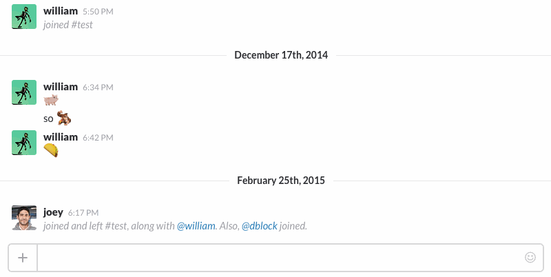

Slack API Explorer
==================

[](http://api-explorer.playplay.io)

Or roll your own ...

[](https://travis-ci.org/dblock/slack-api-explorer)
[](https://codeclimate.com/github/dblock/slack-api-explorer)

An API explorer for Slack.

You can DM the bot.



Or invite it to a channel.



## Usage

### Help

Get help with `api help`.

### Basics

All the commands of [slack-ruby-client](https://github.com/dblock/slack-ruby-client#command-line-client) are supported. The output is JSON.

```
auth test

{
  "ok": true,
  "url": "https://dblockdotorg.slack.com/",
  "team": "dblock",
  "user": "api",
  "team_id": "T04KB5WQH",
  "user_id": "U0HPMN0GY"
}
```

### Parsing

You can pipe a JSON parser. See [jsonpath](https://github.com/joshbuddy/jsonpath) for detailed syntax.

Your team ID.

```
auth test | $.team_id

[
  "T04KB5WQH"
]
```

Names of all unarchived channels.

```
channels list | $..[?(@.is_archived==false)].name

[
  "demo",
  "general",
  "apiapi",
]
```

Find out the ID of the _#general_ channel.

```
channels list | $..[?(@.name=="general")].id

[
  "C04KB5X4D"
]
```

## Installation

Create a new Bot Integration under [services/new/bot](http://slack.com/services/new/bot). Note the API token.
You will be able to invoke the explorer by the name you give it in the UI above.

Run `SLACK_API_TOKEN=<your API token> foreman start`

## Production Deployment

See [DEPLOYMENT](DEPLOYMENT.md)

## Contributing

This bot is built with [slack-ruby-bot](https://github.com/dblock/slack-ruby-bot). See [CONTRIBUTING](CONTRIBUTING.md).

## Copyright and License

Copyright (c) 2016, Daniel Doubrovkine, Artsy and [Contributors](CHANGELOG.md).

This project is licensed under the [MIT License](LICENSE.md).
