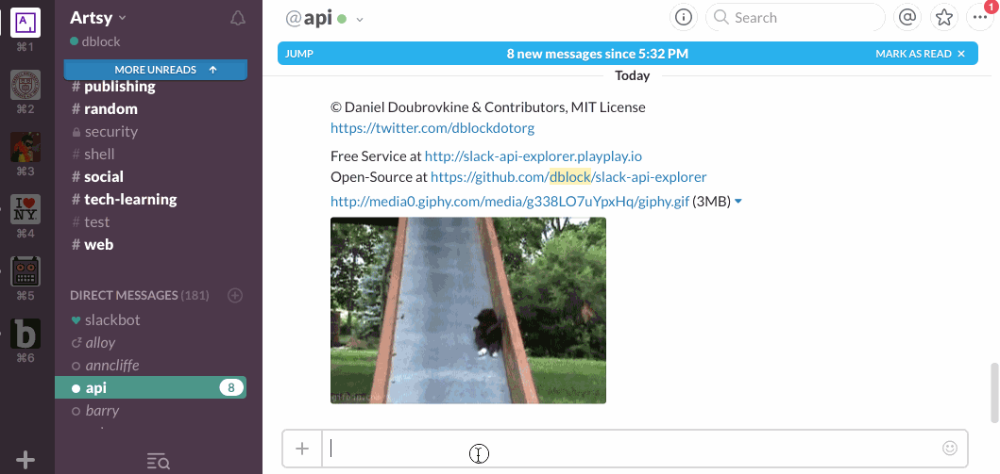

Slack API Explorer
==================

[](https://api-explorer.playplay.io)

Or roll your own ...

[](https://github.com/slack-ruby/slack-api-explorer/actions/workflows/test.yml)

An API explorer for Slack.

You can DM the bot.


Or invite it to a channel.


Post a message into a channel.



## Usage

### Help

Get help with `api help`.

### Basics

All the commands of [slack-ruby-client](https://github.com/dblock/slack-ruby-client#command-line-client) are supported. The output is JSON.

```
auth test

{
  "ok": true,
  "url": "https://dblockdotorg.slack.com/",
  "team": "dblock",
  "user": "api",
  "team_id": "T04KB5WQH",
  "user_id": "U0HPMN0GY"
}
```

### Parsing

You can pipe a JSON parser. See [jsonpath](https://github.com/joshbuddy/jsonpath) for detailed syntax.

Your team ID.

```
auth test | $.team_id

[
  "T04KB5WQH"
]
```

Names of all unarchived channels.

```
conversations list | $..[?(@.is_archived==false)].name

[
  "demo",
  "general",
  "apiapi",
  ...
]
```

Find out the ID of the _#general_ channel, the easy way.

```
conversations info --channel=#general

{
  "ok": true,
  "channel": {
    "id": "C04KB5X4D",
    ...
  }
}
```

Find out the ID of the _#general_ channel, the hard way.

```
conversations list | $..[?(@.name=="general")].id

[
  "C04KB5X4D"
]
```

Post a message into the _#general_ channel.

```
chat postMessage --as_user=true --text="Hello World" --channel=#general

{
  "ok": true,
  "channel": "C034LSACD",
  "ts": "1453588359.000006",
  "message": {
    "type": "message",
    "user": "U0K28DFCY",
    "text": "Hello World",
    "ts": "1453588359.000006"
  }
}
```

## Contributing

This bot is built with [slack-ruby-bot](https://github.com/dblock/slack-ruby-bot). See [CONTRIBUTING](CONTRIBUTING.md).

## Copyright and License

Copyright (c) 2016-2025, Daniel Doubrovkine, Vestris LLC, Artsy and [Contributors](CHANGELOG.md).

This project is licensed under the [MIT License](LICENSE.md).
